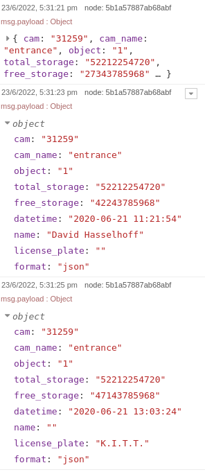
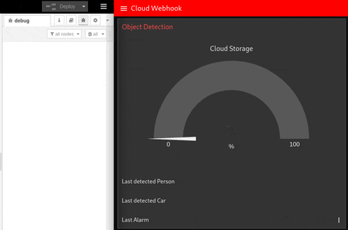

# Node-RED for API Testing

> Mocking a JSON HTTP API for GET and POST Requests in Node-RED

Mock GET and POST Request with JSON Payloads and use Node-RED UI widgets to display the info:

_Note: the Flow has a hardcoded IP address for the Node-RED instance `http://192.168.2.111` that needs to be replaces_

